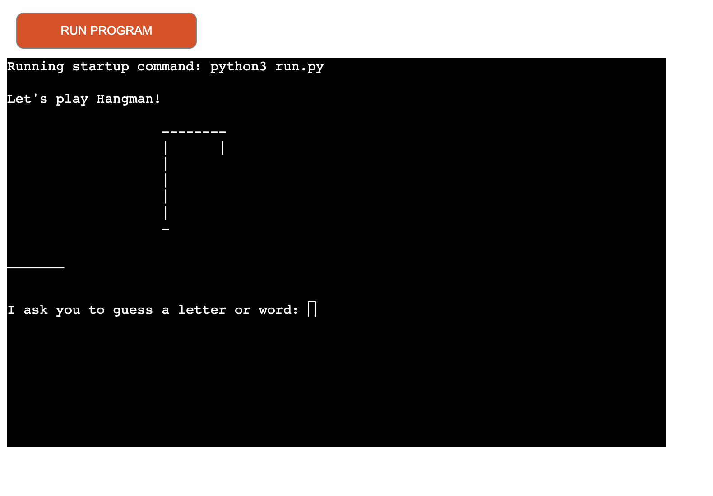
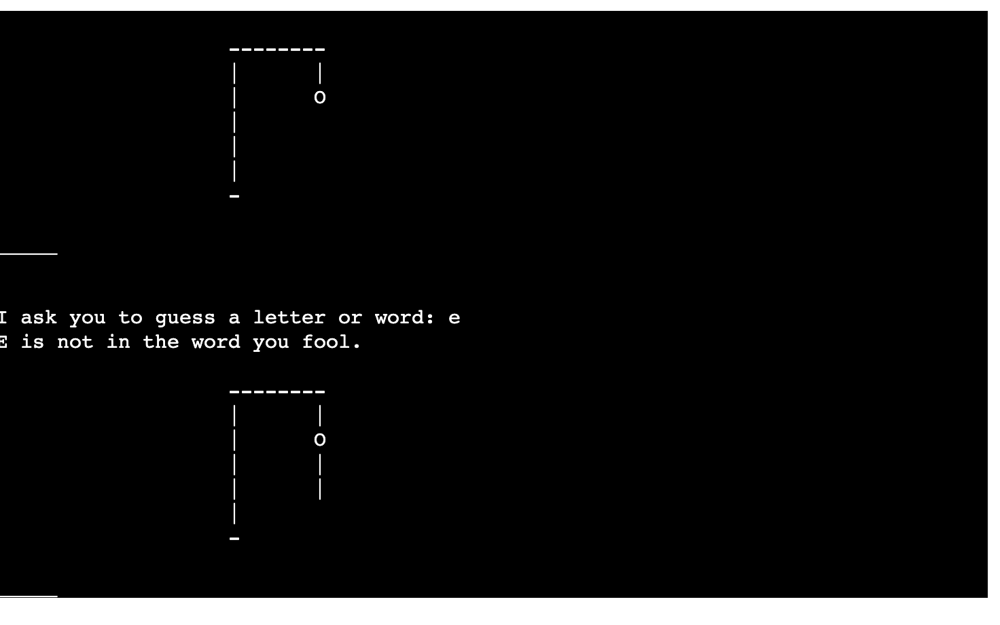
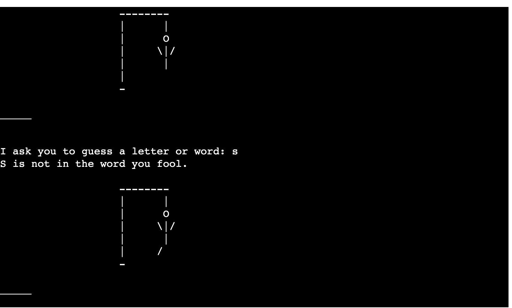
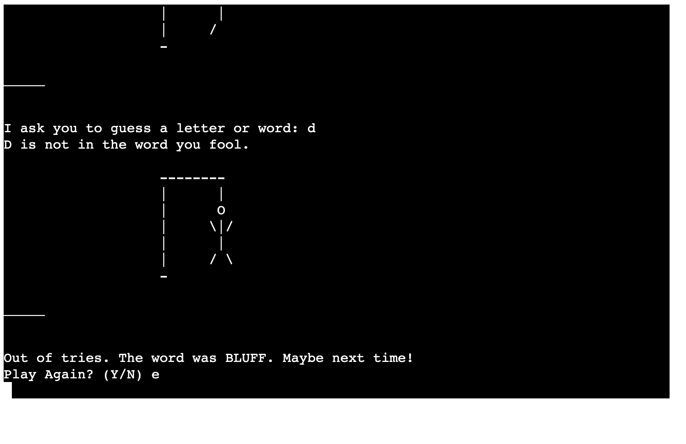

# Hangman

This is my Hangman game that I have created for you to enjoy. I have chosen some words at random to make this game harder to beat.

## How to play 

To play this game, you must guess the randomly chosen word before the prisoner is hanged. Each time you guess incorrectly, more of the prisoner will become visible for a total of 6 tries. If you guess the letter correctly, the letter will appear below the prisoner, and you are asked to try another letter. If you believe you know the word, you can also guess the full word to save the prisoner. 
If you exceed your 6 tries, the prisoner will die, and you will be asked to play again with the next prisoner's life...

## Features

As you can see in the first image, this depicts the basic hangman's noose and the initial failures to guess the word leading to more of the prisoner being visible.

In this next image, you see more of the prisoner being revealed as the letter guessed was incorrect.

In this final image, you can see the full visible prisoner as the word was not guessed in time. This has led to the prisoner's demise, and the game asks you to decide if you wish to play again with the next prisoner's life.

### Future Features 
Give players a themed option of words to choose from, for example, a list of animals or cars, Harry Potter spells and characters, and other such themes.

## Testing
I have tested this project via my deployed site, and it ran without incident.
I ran this code via the PEP8 Validator, and there was only one error that was displayed on line 74 stating that the entries were too long, but I did not know how to reduce this line or overcome this error.

## Bugs
I initially ran into errors with launching my code in a terminal environment to check if it was running properly. Once I resolved this issue and ran my code, things seemed to be working smoothly. I also ran into problems with syntax warnings with invalid escape sequence issues but was able to resolve this issue.

## Deployment 

I followed all steps highlighted in the Love Sandwiches walkthrough and deployed my site via Heroku as instructed without issue.

## Credits
I researched many different tutorials on this game and how I wished to proceed. I used this GitHub repository for the Hangman stage depiction, [link](https://gist.github.com/hridaya423/ecbbe8651f61211bee11adc6de680ed6). I used YouTube walkthroughs like [this one](https://www.youtube.com/watch?v=pFvSb7cb_Us) for ideas and how to build this project. 